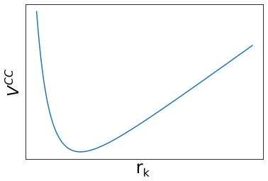

---
title: "Modeling tissues: numerical simulations and continuum mechanics"
author: Guillaume Gay, CENTURI multi-engineering platform, Marseille
subtitle: Part II - Numerical Simulations
fontsize: 10pt
width: 1080
height: 800
font-size: 10pt
bibliography: tyssue.bib
data-transition: none
center: 1
abstract:
    "In this second part of the course, we will go over the various methods used to simulate tissues.
    We will start by showing a rough taxonomy of cell models in general and we'll briefly discuss the general framework of agent-based modelling.  Then we will see in some details the three big classes of tissue modeling strategies:
    1. Lattice based models rely on a descretized space to simulate cells. Each cell here occupies a set of pixels, and the physics of the system is solved locally. Those model are adapted to rapid assessment of tissue dynamics with mixed cell types, proliferation and differentiation models.
    2. Cell-center based models. Here each cell is an individual sphere (maybe deformable) interacting in free space with it's immediate neighbours. This class of model is adapted to problems in cancer biology, involving high cell numbers.
    4. Vertex-based models. Here cells are delinated by polygons or polyhedron, and the phyics is applied at the polygon vertices. This class of models is widely used for morphogenesis modeling.
    For each section, we'll look at published examples and point towards available implementations."
...

------

# A rough taxonomy of tissue models

::::::{.columns}:::
:::{.column width=30%}

:::
:::{.column width=70%}
\vspace{2cm}
This courses relies a lot on Carlos Tamulonis' [PhD Thesis](https://hdl.handle.net/11245/1.394902) (2013)
:::
::::::

------

## Population dynamics

:::incremental:::
* Only concerned with $N(t)$
* Focus on **signaling** and growth / death rates
* Main use is **mathematical oncology**:
  predict cancer growth in response to treatment
::::

---------

![[[@zhaoModelingTumorClonal2016]](https://doi.org/10.1016/j.trecan.2016.02.001)](images/pop_dyn.jpg){ width=80% }

## Agent based modelling

:::incremental::::
* Cells are **agents**: they _act_
* Follow each cell behavior
* Broad range of problems:
  - cancer
  - morphogenesis
:::::

# Lattice based models

## Game of life
(James Conway)

* Not really cells, but Cellular Automata
* Classical 'emergent behavior' system

{ width=50% }

. . .

Follow [this link](https://distill.pub/2020/growing-ca/) for a fun example of cellular automata

## The Graner Glazier Hogeweg model

:::::::::{.columns}:::
:::{.column width=60%}::::
:::incremental::::
\vspace{1cm}
* The world is a fixed grid
* Each cell $\alpha$ occupies a set of pixels
* Pixels at the interface can swap cells
::::
::::
:::{.column width=40%}::::
{ width=60% }

:::
:::::::

### The Modified Metropolis Algorithm

The behavior is governed by the definition of a **Hamiltonian** $H$ governing the energy of the cells

Changes follow a simple local algorithm:

:::::::::{.columns}:::
:::{.column width=60%}::::
:::incremental
1. Choose randomly a site $(i, j)$
2. Compute the change $\Delta H$ if $(i, j)$ swaps cell
3. If $\Delta H < 0$ : swap cell
4. If $\Delta H \geq 0$ : swap cell with probability $\exp( - \Delta H / kT)$ _(T is not a "real" temperature)_

:::
::::
:::{.column width=40%}::::
{ width=60% }

. . .

{ width=60% }
:::
:::::::

### Cellular Potts Model Hamiltonian

The game is now to define the Hamiltonian to better reflect our problem!

. . .

The simplest model: volume conservation and adhesion:

\begin{align*}
H & = & H_V + H_i \\
H_V & = & \frac{\lambda}{2} \sum_\alpha (V_\alpha - V_0)^2 \\
H_i & = & \sum_{ij, i'j'} J \left( \tau(ij), \tau(i'j') \right)
\end{align*}

$\tau(ij)$ type of cell at $ij$

$J\left(\tau(ij), \tau(i'j')\right)$ : bond energy

----

#### Cell sorting

A classical problem:

2 cell types $(1, 2)$ --- $0$ is the medium

\begin{eqnarray*}
J(1, 1) & = & 0\\
J(1, 1) & = & 1\\
J(2, 2) & = & 8\\
J(2, 1) & = & 16\\
J(1, 0) & = &  J(2, 0) = 32
\end{eqnarray*}

. . .

Contact prefered between same type, 1 more so than 2

----

What happens?

. . .

### Chemotaxis

Add a term for chemotaxis:

- chemoatractant distribution on the grid ($C(ij)$)
- Favor switch for increasing $C$:

$$
H' = H - \mu \left(C(ij) - C(i'j') \right)
$$

* The chemoatractant can be *produced* by the cells (cAMP)

. . .

:::{.columns}::::
:::{.column width=30%}

:::
:::{.column width=70%}
![[@savillModellingMorphogenesisSingle1997]](images/SavillHogweg.png)
:::
::::::

### Existing Software

- Chaste
- CompuCell3D
- Morpheus

# Cells as spheres

{ width=60% }

- Cells are defined by their position in free space
- Movement goverened by Newton:

$$
\sum F = m a \approx 0
$$

- Forces:
  * Cell-cell interactions
  * Fluid mechanics interactions with the medium

## Mechanical impact of cell dynamics

------

- Cell-cell interactions:

$$
V^{CC}(r) = \begin{cases}
    \frac{f_0 R_{pp}^5}{4r_k^4} + (f_0 + f_1) r_k - (1.25 f_0 + f_1) &\quad r_k \leq R_{pp}\\
    0 &\quad r_k > R_{pp}\\
    \end{cases}
$$

. . .

{ width=30% }

. . .

- Self-interaction (growth):

$$
V^G(r) = \frac{B}{r_i + r_0}
$$

----

![Fluidization [@ranftFluidizationTissuesCell2010]](images/joanny.png)

> Due to proliferation and death, cell aggreagate behaces as a fluid

## Modeling tumors

- Spheres with adhesion and repulsion

![[@drasdoSinglecellbasedModelTumor2005]](images/drasdo1.png){ width=60% }

- Same Metropolis alorithm as GGH:

$$
P(\delta r) = \min \{ 1, \exp \frac{V(t + dt) - V(t)}{F_T} \}
$$

## Mixed resolution models

- Deformable cells at high resolution meshes mixed with cell-based model

![[@vanliedekerkeQuantitativeHighresolutionComputational2020]](images/drasdo2.png)

- Complex continuous / fluid dynamics finite elements for cells
- Very "realistic" results
- High computational cost

## PhysiCell (Mathematical Oncology)

[Physicell](https://physicell.wordpress.com/about-2/) is a very powerfull simulation toolkit

![[@ghaffarizadehPhysiCellOpenSource2018]](images/PhysiCell.png)

-----

* Friction and adhesion model
* Very multi-agent oriented
* Coupled with a powerfull reaction / diffusion solver,
  [BioFMV](http://biofvm.mathcancer.org/)

# Cells as polygons

The apical junctions meshworks play a central role in many
morphogenesis events [@lecuit_cell_2007] and are poorly rendered by cell center models.

## Topology of epithelium

### Voronoï tessalation [@hondaThreedimensionalVertexDynamics2004]

Instead of focusing on the cell centers, we now look at the contact between junctions

-----

When distances between the centers change, the tessalation changes.

> **Problem** we can have oscilating

* Solution 1 : The active vertex model : Consider the Delaunay
triangulation instead of it's dual [@bartonActiveVertexModel2016], and
compute it at every step

* Solution 2 : Allow for more than 3 way vertices! [@fineganTricellularVertexspecificAdhesion2019]

## Mechanical Model formulations

### 2D Models

* [@farhadifar_influence_2007]

* [@biDensityindependentRigidityTransition2015]

### 3D Models

*

### Towards rheological models

### Existing implementations

* Chaste
* Tyssue
