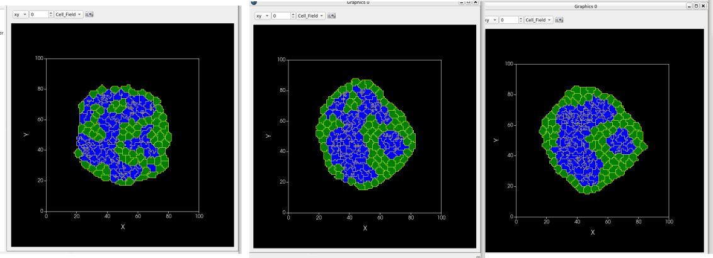

---
title: An overview of tissue modelling approaches
author: Guillaume Gay, France BioImaging, Montpellier
fontsize: 10pt
width: 1080
height: 800
bibliography: tyssue.bib
data-transition: none
center: 1
...

# A rough taxonomy of tissue models

------

::::::{.columns}:::
:::{.column width=70%}
\vspace{2cm}
This presentation relies a lot on Carlos Tamulonis'

[PhD Thesis](https://hdl.handle.net/11245/1.394902) (2013)
:::
:::{.column width=30%}

:::
::::::

------

{ width=70% }

# Lattice based models

### Conway's Game of life

:::::::::{.columns}:::
:::{.column width=60%}::::
::: incremental
* Not really cells, but Cellular Automata

* Classical 'emergent behavior' system

* See [distill.pub/2020/growing-ca](https://distill.pub/2020/growing-ca/) for a fun example of cellular automata

::::
::::
:::{.column width=40%}::::

{ width=50% }

:::
:::::::

### The Graner Glazier Hogeweg model

:::::::::{.columns}:::
:::{.column width=60%}::::
::: incremental
\vspace{1cm}
* The world is a fixed grid
* Each cell $\alpha$ occupies a set of pixels
* Pixels at the interface can swap cells
::::
::::
:::{.column width=40%}::::
{ width=60% }
:::
:::::::

### The Modified Metropolis Algorithm

The behavior is governed by the definition of a **Hamiltonian** $H$

:::::::::{.columns}:::
:::{.column width=60%}::::
Changes follow a local algorithm:

::: incremental
1. Choose randomly a site $(i, j)$
2. Compute the change $\Delta H$ if $(i, j)$ swaps cell
3. If $\Delta H < 0$ : swap cell
4. If $\Delta H \geq 0$ : swap cell with probability $\exp( - \Delta H / kT)$ _(T is not a "real" temperature)_

:::
::::
:::{.column width=40%}::::

::: incremental

- { width=60% }

- { width=60% }

:::
:::
:::::::

### Cellular Potts Model Hamiltonian

The game is now to define the Hamiltonian to better reflect our problem!

. . .

The simplest model: volume conservation and adhesion:

\begin{align*}
H & = & H_V + H_i \\
H_V & = & \frac{\lambda}{2} \sum_\alpha (V_\alpha - V_0)^2 \\
H_i & = & \sum_{ij, i'j'} J \left( \tau(ij), \tau(i'j') \right)
\end{align*}

$\tau(ij)$ type of cell at $ij$

$J\left(\tau(ij), \tau(i'j')\right)$ : bond energy

----

#### Cell sorting

A classical problem:

2 cell types $(1, 2)$ --- $0$ is the medium

\begin{eqnarray*}
J(0, 0) & = & 0\\
J(1, 1) & = & 1\\
J(2, 2) & = & 8\\
J(2, 1) & = & 16\\
J(1, 0) & = &  J(2, 0) = 32
\end{eqnarray*}

{ width=60% }

### Chemotaxis

Add a term for chemotaxis:

- chemoatractant distribution on the grid ($C(ij)$)

- Favor switch for increasing $C$:

$$
H' = H - \mu \left(C(ij) - C(i'j') \right)
$$

* The chemoatractant can be *produced* by the cells (cAMP)

. . .

:::{.columns}::::
:::{.column width=30%}:::

:::
:::{.column width=70%}:::
![[@savillModellingMorphogenesisSingle1997]](images/SavillHogweg.png)
:::
::::::

# Cells as spheres

:::{.columns}::::
:::{.column width=40%}
{ width=60% }
:::
:::{.column width=60%}
::: incremental
- Cells are defined by their position in free space
- Movement goverened by Newton's 2nd law:
$$
\sum F = m a \approx 0
$$
- Forces:
  * Cell-cell interactions
  * Friction with the medium
:::
:::
::::::

## PhysiCell (Mathematical Oncology)

[Physicell](https://physicell.wordpress.com/about-2/) is a very powerfull simulation toolkit

:::{.columns}:::::::::
:::{.column}:::
![[@ghaffarizadehPhysiCellOpenSource2018]](images/PhysiCell.png){ width=60% }
:::
:::{.column}:::
::: incremental
* Friction and adhesion model
* Very multi-agent oriented
* Coupled with a powerfull reaction / diffusion solver,
  [BioFMV](http://biofvm.mathcancer.org/)
:::
:::
::::::

# Cells as polygons

The apical junctions meshwork plays a central role in many
morphogenesis events [@lecuit_cell_2007] and are poorly rendered by cell center models.

{ width=60% }

## Mechanical Model formulations

### 2D Models

#### Influence of cell packing

Quasi-static solution of:

$$
E = \sum_\alpha \frac{K_A}{2}(A_\alpha - A_0)^2 + \Gamma P_\alpha^2 + \sum_{ij}\Lambda \ell_{ij}
$$

:::{.columns}:::::::::
:::{.column width=60% }:::
![[@farhadifar_influence_2007]](images/faradifar_model.jpeg)
:::
:::{.column width=40% }:::

:::
::::::

#### Rigidity transition

![[@biDensityindependentRigidityTransition2015]](images/bietal.png)

$$
\epsilon = \sum_\alpha (a_\alpha - 1)^2 +\frac{(p_\alpha - p_0)^2}{r}
$$

#### Apical junctions in 2.5D

:::{.columns}:::::::::
:::{.column width=40% }

- total volume conservation
- weigthed sum for the perimeter
- Apico-basal traction during apoptosis

:::
:::{.column width=60% }

![[@martinArp23dependentMechanical2021]](images/martinetal.png){ width=80% }

$$
p'_\alpha = \frac{1}{n}\frac {\sum_{ij \in \alpha} w_{ij}\ell_{ij}}{\sum_{ij \in \alpha} w_{ij}}
$$

:::
::::::

### 3D Models

#### Monolayer and the ECM

* [@bielmeier_interface_2016] Extrapolates to 3D the 2D formulation

:::{.columns}:::::::::
:::{.column}

:::
:::{.column}

:::
::::::

#### Monlayer and bulk tissues

Sophisticated expression for the friction in [@okudaThreedimensionalVertexModel2015]

#### Cells as foam

Consider surface tension and Laplace foce balance

![[@maitreAsymmetricDivisionContractile2016]](images/turlieretal.png)

# Finite elements approaches

## Active surfaces

Interacting active surfaces: detailed model of the cell cortex

](images/torrez-sanchez2023.png){ width=70% }

## Mixed resolution models

- Deformable cells at high resolution meshes mixed with cell-based model

![[@vanliedekerkeQuantitativeHighresolutionComputational2020]](images/drasdo2.png)

- Continuous / fluid dynamics finite elements for cells
- Very "realistic" results
- High computational cost

-------

### Open problems

:::{.columns}:::::::::
:::{.column}:::
::: incremental
* Topology and remeshing in 3D vertex models
* Non-naive ECM
* Nuclei
* Combining molecular / particle dynamics and FE models?
* Many more (it's exciting!)
:::
:::
:::{.column}:::

:::
::::::

### Tank you

* Magali Suzanne and her team
* Cyprien Gay
* The `tyssue` contributors
* The Scipy and Python communities

## References

::: {#refs}

:::
